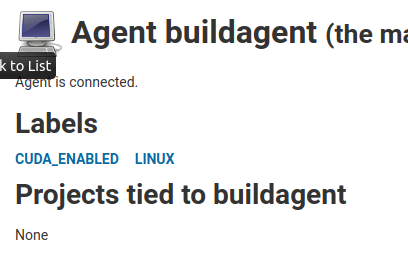
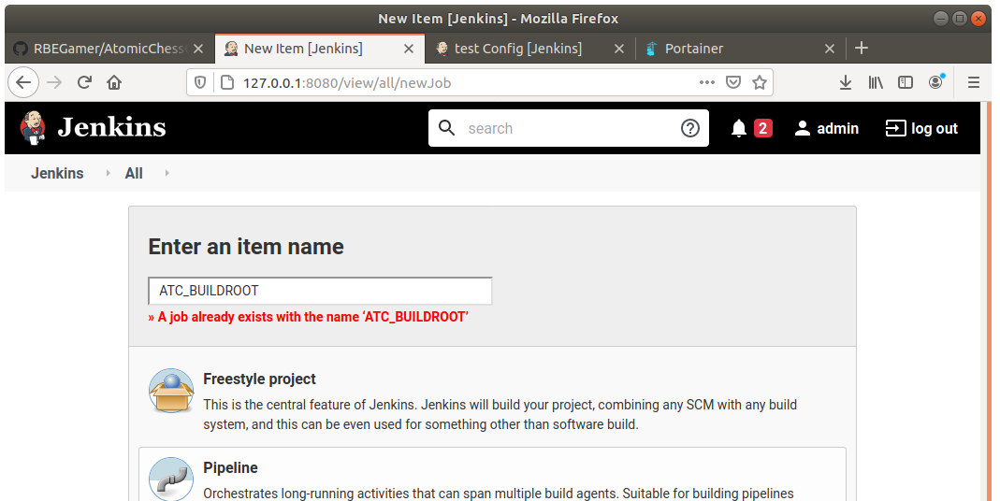

## Continous Integration

### WHY CI

### ADVANTAGES IN THIS PROJECT
For debugging and testing, building, checking the result, doing these step manually is okay.
But after the basic setup is working, the next task is to automate this tasks.
Especially, becuase the build process of buildroot can take serveral hours and the development pc is working hard to accomplish this task.
A good solution is outsource this task to a dedicated server. With an installed CI system on the server its not nessessary to kick off the process manualy.

The end result should be:

* Developer commits changes to release branch
* CI System detect changes and starts build process
* After successful build, save build artefacts
* (Publish build artefacts to production system)

In the case of building an sd card image for the embedded system, a manual step is needed to get the build files from the CI system running. So the CI can not publish the artefact to a production system. A better solution in this task is, to notify the developer that a build is succeed.

### WHAT IS JENKINS

### SETUP JENKINS BLUEOCEAN

For this setup, the server is a virtual machine hosted on AWS (Amazon Web Service). Here is used a `AWS EC2 t3.2xlarge` instance.
This instance type offers 8 cpu threads and 32GiB of RAM. The Harddrive-Storage is here not important, the network troughput too.
As virtual machine base image (OS), we choose Amazon Linux which is based on Debian Linux.
It has a basic setup and preinstall applications like Docker and it is also hardened about remote root access.

This virtual machine is used to host the Jenkins Master, Build-Agents and the ATC_Server.

#### INSTALL JENKINS BLUEOCEAN

The setup of the jenkins software is very easy though the usage of Docker.
Jenkins offers a Docker-Image which can be installed though the `docker-cli`:

* `$ docker --version`, checks if docker is installed.
* `$ docker container run --name jenkins-blueocean --env DOCKER_HOST=tcp://docker:2376 -v $(pwd)/jenkins_conf:/var/jenkins_home -p 8080:8080 -p 50000:50000 --restart always jenkinsci/blueocean`, pull docker image and start a new container using this image.

##### SITENOTE CONTAINER MANAGEMENT

Its possible to manage all docker container thought the `docker-cli`. There is also a webinterface for manage them, called portainer.
The portainer-webinterface allows to start/stop/create containers, image repository management and gives detailed logs and statistics over running containers.
Portainer is also able to manage a docker swarm or stack environment. In this reason portainer was also used to manage the docker environment on the remote server from the development pc.

The installation of portainer is very simple:

* `$ docker volume create portainer_data`, creates a volume for configuration data.
* `$ docker run -d -p 8000:8000 -p 9000:9000 --name=portainer --restart=always -v /var/run/docker.sock:/var/run/docker.sock -v portainer_data:/data portainer/portainer-ce`, start the portainer container. Its important to mount the local docker environment to the container using `-v /var/run/docker.sock:/var/run/docker.sock`.

The webinterface can be accessed with an brower pointing to `http://127.0.0.1:9000/`.

##### END SITENOTE

The Container needs two ports to be opened to the outside. On port `8080` the webinterface that jenkins provide can be accessed.
After successful start og the container, its possible to access the webinterface with the browser `http://127.0.0.1:8080/`.

The next steps are some basic installation questions:

* Install recommended plugins
* Setup a user account

Now we need to setup a few things in Jenkins before creating a new Job.

The whole project uses GitHub as Version-Control-System. Jenkins offers a plugin to connect to the GitHub Plattform.

#### CREATE SSH CREDENTAILS

The sourcecode of the buildroot project, is stored in a git repository.
The repository is private and a clone is only possible, if the ssh key of the git client is registered on the git server.

On the development pc this is already the case, because it is needed to pull and push changes to the git repository.

On the Jenkins site, is is also nessessary, otherwise the jenkins agent can not pull the sourcecode from the git repository.

For security resonse the first step is to generate a new ssh keypair, that is only used for the jenkins<->git authentication.

A new keypair can generated with the `ssh-keygen` utility, which is installed on Ubuntu/Debian by default.

 `$ ssh-keygen -t rsa -C "jenkinsdev@prodevmo.com"`

 The tool asks for the storage location of the new key, here it is important to change the location due to avoiding to override existing keys.
 In the example the path `/home/prodevmo/.ssh/jenkins_master` was used.

 After `ssh-keygen` finished, it generates two files in the chosen directory:

 * `jenkins_master`, the private key file
 * `jenkins_master.pub`, the public key file

The content of the `jenkins_master.pub`, has to be saved on the git server.
For example, the process to add the new generated key to github is:

 Open a new brower and navigate to `github.com/settings/keys` and klick `new key`.
 In the following window paste the content of the `jenkins_master.pub` file and click `Add SSH Key`

 

 This proces is the same for other git systems like Bitbucket or GitLab, the GitHub workflow is only an example.

 Now the git server is setup with the new key, now we have to register the private key to the jenkins master.

 In order to do that, we have to navigate to the credentaials settings in jenkins : 
 `Jenkins->Manage Jenkins -> Manage Credentaials` and click under `Stores scoped to Jenkins` on `Domains (global)`.

On the left window, click on `Add Credentials`, to add a new Entry.
Select in the `Kind` drop-down menu `SSH Username with private key`, and paste the content of the private key file `jenkins_master` into the textfield. After clicking on the `OK` Button the key is saved and the setup of the ssh key is complete.

#### CREATE AGENT

Before we can create a new job or project, its nessessary to create a build agent.
At this point we can only create one permanent agent. So the setup process is easy, simply clock thought the setup dialog.
In this installation, the name of the new agent is called `buildagent`.

On the jenkins agent overview page. Our new created agent is marked with a red cross symbol. This is becuase our created agent is not running on any system.
After a click on the agent `Jenkins->Nodes->buildagent` we can see on the status tab, a small manual how to start the agent.

The agent can run on the same machine as the master or on any other system. In our case we start the agent on the same server as the jenkins container is running.

After downloading the `agent.jar` file and open the folder in a new terminal, we use the command given on the page to start the agent:
`$ java -jar agent.jar -jnlpUrl http://127.0.0.1:8080/computer/buildagent/slave-agent.jnlp -secret <SECRET_TOKEN> -workDir "/var/jenkins"`

After the agent is started, we can see on the status page, that the agent is connected and is waiting for jobs.

With this one agent installed, jenkins schedules any new build job to run on this agent.
Its also possible to give different agent different abilities. This can be used if a job has specific requirements to build.
For example the build process need specific hardware like a GPU or FPGA card or architecture, then its possible to run a agent on the specific hardware.
With labeling of the agent, its possible to tell jenkins that only jobs, that require special hardware to run on this agent.

For example the agent we setup before runs on a server with an Nvidia Tesla K80. In this case at setup, the agent was labaled with `CUDA_ENABLED`.
A job that requires CUDA can run on this agent.

#### CREATE JOB (PROJECT)

Now the basic jenkins setup is complete and the next step is to setup a project. Jenkins offers different kind of project templates.

For this simple job, to build our buildroot image, a `Freestyle project` was chosen.

Now w

#### JENKINS BUILD AGENT
* build server
* docker
* persisten storage

* setup project; autobuild project
* trigger build with git

# HOW TO HANDLE ARTEFACTS
* what are artefacts
* using ftp to upload final image
* tag the git commit thats build

